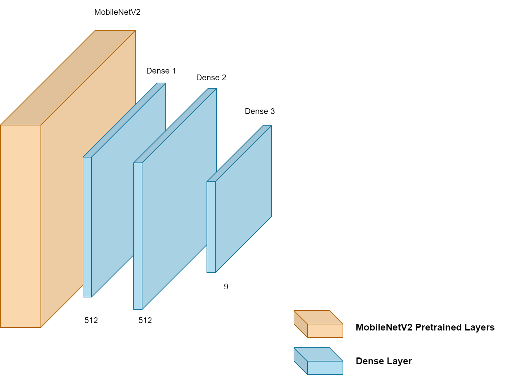

# Indonesian Food Recognition Model
This repository contains a deep learning model built using TensorFlow for the recognition of Indonesian food.

## How to Run
(masukkin yang elu bim, penomeran ke bawahnya entar sesuain aja) 

5. Make sure that the .h5 model is already saved in the “Model” folder. 

6. Run the converter_tflite.py script from your IDE or run the following command in the terminal that is running on the project directory. 
```
python converter_tflite.py
```
7. Your .tflite model is now saved on the “Model” folder. 

## Dataset


Our dataset consists of 1920 total images divided into 9 classes, with details as follows.

| Class | Amount | 
| --- | --- |
| Ayam Goreng | 211 |
| Ayam Pop | 208 |
| Gulai Ikan | 211 |
| Gulai Tambusu | 203 |
| Gulai Tunjang | 222 |
| Rendang | 214 |
| Dendeng | 242 |
| Telur Balado | 206 |
| Telur Dadar | 203 |

But in our training process, we limit each class to only use 203 images. The dataset itself is sourced from various sites, mainly from Kaggle, with addition from Cookpad, Twitter, Instagram, etc.

## Model Architecture
 

## Model Performance
The model achieved 89.62% accuracy on the test dataset. With details as follows.


## References
https://www.kaggle.com/datasets/faldoae/padangfood 

https://cookpad.com/id/cari/resep%20masakan%20indonesia
